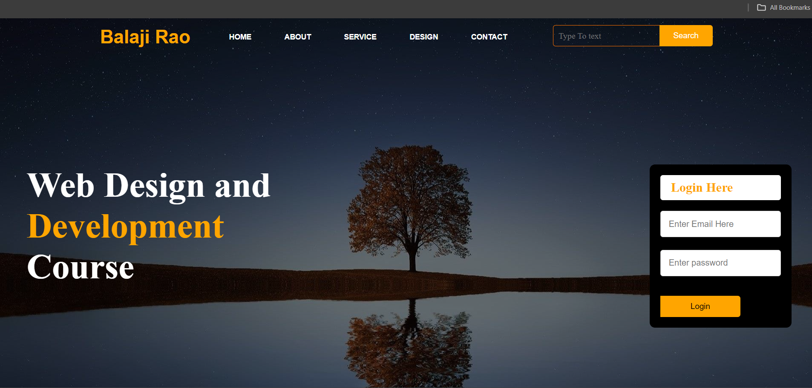

# Web Design and Development Course

## Overview

This project is a simple web design and development course landing page. It features a navigation bar, a search bar, a login form, and a form submission success page. The page is styled using CSS and is a great starting point for beginners in web development.



## Features

- **Navigation Bar**: Links to different sections of the website.
- **Search Bar**: Allows users to search for content.
- **Login Form**: Users can enter their email and password to log in.
- **Form Submission Success Page**: Displays a success message upon form submission.

## Technologies Used

- **HTML**: For structuring the web pages.
- **CSS**: For styling the web pages.


## Getting Started

### Prerequisites

- A web browser (e.g., Chrome, Firefox, Edge)

### Installation

1. Clone the repository:

    ```bash
    git clone https://github.com/YBalajiRao/Web-Design-Course-Portal.git
    cd Web-Design-Course-Portal
    ```

2. Open the `index.html` file in your web browser to view the project.

## Usage

- Navigate through the website using the navigation bar.
- Use the search bar to search for content.
- Fill in the login form to log in.
- Upon form submission, you will be redirected to a success page.
